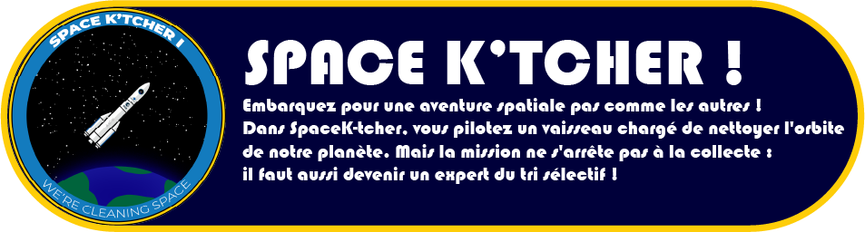
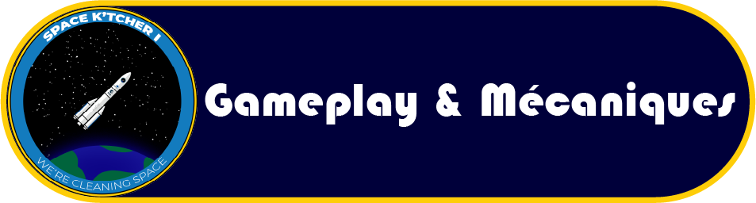
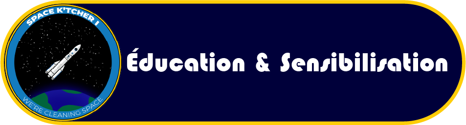
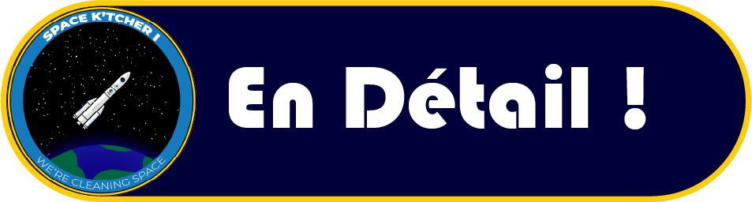
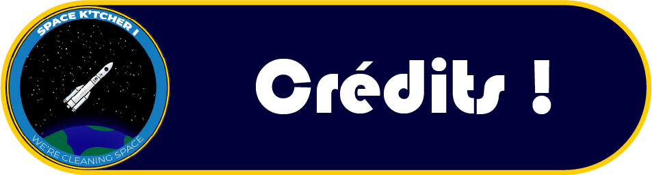

<p align="center">
  
</p>


<p align="center">
  
  
  
</p>

## 📖 Présentation

### À propos de SpaceK'tcher
**SpaceK'tcher** est un jeu vidéo éducatif développé en Python avec Pygame. Vous y incarnez un nettoyeur de l'espace dont la mission est de récolter les débris et déchets flottant dans l'orbite terrestre, avant de les renvoyer dans un centre de tri adapté sur Terre.

### L'Objectif du jeu
L'espace est pollué ! La mission de votre vaisseau est simple :
1. **Récolter** un maximum de déchets en évitant les obstacles et les débris dangereux.
2. **Trier** correctement la récolte dans le centre de tri galactique pour maximiser votre score environnemental.

---

<p align="center">
  
</p>


### Comment jouer ?
Le jeu se divise en deux phases distinctes :
- **La phase de Collecte** : Manoeuvrez votre vaisseau spatial pour attraper les déchets qui dérivent, tout en esquivant les astéroïdes et les débris orbitaux. 
- **La phase du Centre de tri** : Une fois la soute pleine, redescendez sur Terre pour jeter chaque objet récolté dans la bonne poubelle.

### Les Commandes
- **Flèches directionnelles** (ou **ZQSD** / **WASD**) : Déplacer le vaisseau dans l'espace.
- **Espace** / **Clic Gauche** : Interagir / Attraper (selon le niveau).
- **Souris** : Glisser-déposer (Drag & Drop) les objets dans leurs poubelles respectives lors du tri.
- **Échap** : Mettre le jeu en pause / Quitter.

### Les Niveaux du jeu
1. **Orbital Cleanup (Collecte)** : Esquive et réflexes dictent votre réussite. Plus vous avancez, plus la vitesse et la densité de débris augmentent.
2. **Sorting Center (Centre de tri)** : Un jeu de logique et de rapidité où vous reliez le bon déchet à sa filière de recyclage (Vert, Jaune, Bleu).

---

<p align="center">
     
</p>


### L'Aspect Pédagogique
Ce jeu a été conçu pour sensibiliser de manière ludique aux enjeux de la pollution, en l'occurrence spatiale et terrestre, et à l'importance primordiale du recyclage.

### Guide du Recyclage Galactique
Prenez soin de mémoriser les correspondances :
- **Poubelle Verte** : Uniquement pour le **Verre** (ex: Bouteille en verre).
- **Poubelle Jaune** : Pour les **Plastiques, Cartons et Métaux** (ex: Canette).
- **Poubelle Bleue/Grise** : Pour les **Ordures ménagères** et déchets non recyclables (ex: Yaourt, peau de banane).

---

<p align="center">
     
</p>


### Technologies utilisées
- **Langage** : [Python](https://www.python.org/)
- **Moteur 2D** : [Pygame](https://www.pygame.org/) (version `2.6.1`)
- **Particules** : Système de particules customisé pour l'immersion spatiale (`particle_system.py`)

### Installation et Lancement

1. **Cloner ou Télécharger le dépôt** :
   ```bash
   git clone https://github.com/votre-nom/SpaceK-tcher.git
   cd SpaceK-tcher
   ```

2. **Créer un environnement virtuel (Optionnel mais recommandé)** :
   ```bash
   python -m venv venv
   source venv/bin/activate  # Sur Windows : venv\Scripts\activate
   ```

3. **Installer les dépendances** :
   ```bash
   pip install -r requirements.txt
   ```

4. **Lancer le jeu** :
   ```bash
   python main.py
   ```

### Structure du Projet
```text
SpaceK-tcher/
├── assets/             # Images, Bruitages, Sons, UI
├── main.py             # Point d'entrée principal du jeu
├── game.py             # Boucle principale et états du jeu
├── level.py            # Logique de la phase de collecte dans l'espace
├── sorting_level.py    # Logique de la phase du centre de tri
├── player.py           # Contient la classe du vaisseau/joueur
├── particle_system.py  # Gestion des effets visuels et étoiles
├── settings.py         # Paramètres globaux (couleurs, catégories, constantes)
├── utils.py            # Fonctions utilitaires
└── requirements.txt    # Dépendances (Pygame)
```

---

<p align="center">
         
</p>


### L'Équipe de développement
- **Maxime**  - *Chef de Projet*    
- **Kérywan** - *Dev & Struc.* 
- **Matias** - *Chef Designer*
- **Yoan** - *Ingé-Son*
- **Enzo** - *Designer*
- **Jules** - *Dev & Designer*

> *Merci d'avoir joué à SpaceK'tcher et de contribuer à la propreté de notre galaxie !* 🌌
